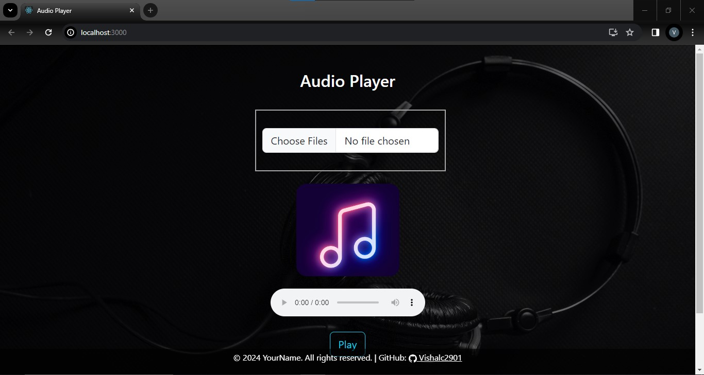
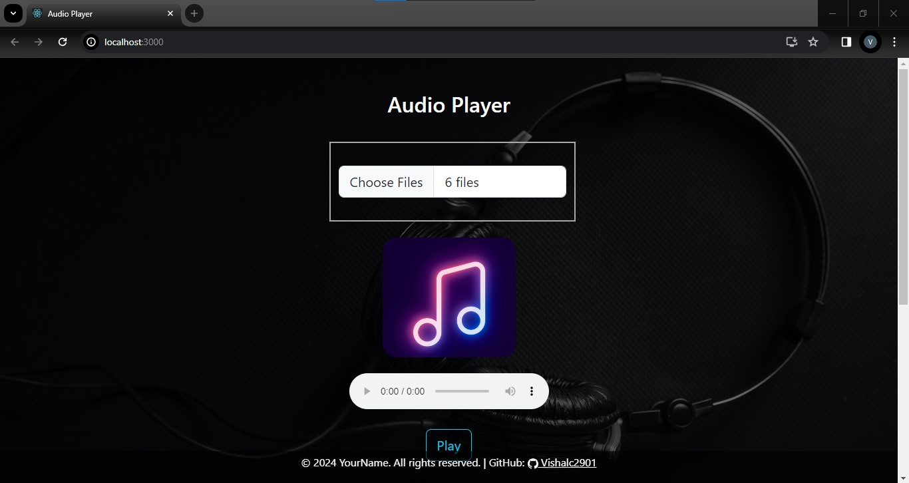
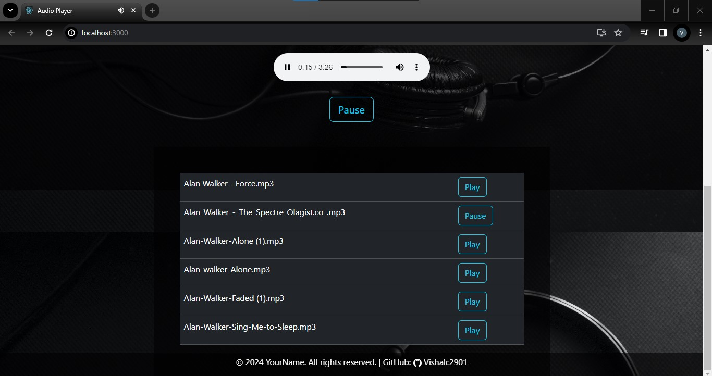

# Audio Player App

This is a simple audio player app built using React.

## Screenshots

## Features

- Upload multiple audio files.
- Play, pause, and switch between tracks.
- Remember the last played track using local storage.

## Installation

1. Clone this repository.
2. Navigate to the project directory.
3. Run `npm install` to install dependencies.
4. Run `npm start` to start the development server.

## Usage

1. Click on the "Choose File" button to select audio files from your device.
2. Click on the "Play" button to start playing the audio.
3. Click on the "Pause" button to pause the audio.
4. Click on a track in the playlist to play it.
5. The app remembers the last played track even after refreshing the page.

## Dependencies

- React
- Bootstrap (for styling)

## Contributing

Contributions are welcome! Please feel free to submit issues and pull requests.
